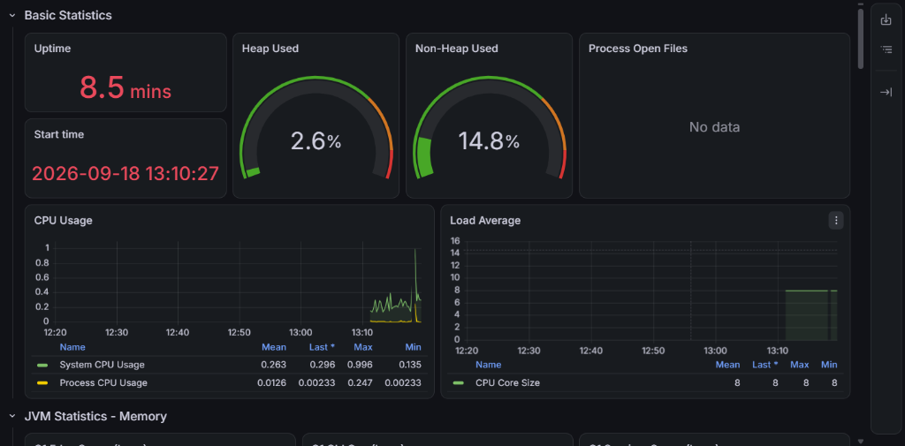
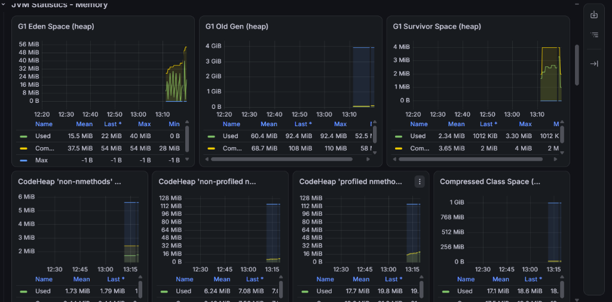

<h1 align="center">Flash-Sale Engine ⚡</h1>

<p align="center">
  A high-performance, resilient e-commerce core designed to handle extreme traffic spikes (e.g., Black Friday sales) with zero overbooking. Built with modern FinTech standards.
</p>

## 🚀 Tech Stack

- **Java 21** & **Spring Boot 4.x** (REST APIs, AOP, Actuator)
- **Redis & Lua** (Atomic stock operations, Search Caching)
- **Apache Kafka** (Event-driven architecture, Saga Pattern)
- **PostgreSQL** (Transactional Outbox Pattern)
- **Elasticsearch** (Lightning-fast full-text search)
- **Spring Security & JWT** (Stateless authentication)
- **Resilience4j** (Rate Limiting, DDoS protection)
- **Prometheus & Grafana** (Observability and JVM Monitoring)
- **Grafana k6 & Docker** (Stress testing)

---

## 🏗️ Architecture & Patterns

### 1. Zero Overbooking (Redis + Lua)
Traditional RDBMS transactions fail under extreme concurrent load (deadlocks, performance degradation). This project uses an atomic **Lua script executed in Redis** to decrement stock. It processes 500+ concurrent purchase requests per second with absolute data consistency and 0% chance of negative inventory.

### 2. Distributed Transactions (Saga Pattern)
When an order is placed, a `PaymentSagaListener` listens to Kafka events. If a payment fails (simulated dynamically), the system fires a compensating transaction to roll back the order status to `FAILED` and increment the stock back in Redis, ensuring eventual consistency across microservices.

### 3. Reliable Event Delivery (Transactional Outbox)
To solve the dual-write problem (saving an order to DB + publishing a message to Kafka), the system implements the **Outbox Pattern**. Events are saved to an `outbox_events` table in the same local transaction as the order. A background scheduler then safely publishes them to Kafka, guaranteeing *at-least-once* delivery.

### 4. DDoS Protection (Rate Limiting)
To protect the database and downstream services from botnets or aggressive traffic, **Resilience4j** is configured on critical endpoints. It strictly limits requests (e.g., 5 req/sec per node) and gracefully rejects excessive traffic with HTTP `429 Too Many Requests`.

### 5. High-Speed Search Caching
Elasticsearch provides fast full-text search, but network I/O is expensive. The `@Cacheable` abstraction is used to cache Elasticsearch query results directly in **Redis**, reducing response times from 30ms to <2ms for popular queries.

---

## 📊 Observability & Load Testing

The system is fully instrumented with Micrometer. **Prometheus** scrapes JVM metrics, connection pools, and HTTP throughput, visualizing them in **Grafana**.

### Stress Testing with K6
A rigorous load test was conducted using `k6` with **500 concurrent Virtual Users (VUs)** attacking the checkout API simultaneously.

**Results:**
- 🛡️ **DDoS Defense:** ~4800 requests were successfully intercepted and rate-limited (`HTTP 429`), protecting the CPU from exhaustion.
- 🎯 **Accuracy:** Exactly the remaining 20 items in stock were purchased (`HTTP 200`). The other valid requests received `HTTP 400 (Out of stock)`.
- ⚡ **Performance:** The HikariCP connection pool remained stable, and the Garbage Collector efficiently cleared the young generation (Eden space) without "Stop-The-World" pauses.

### Grafana Dashboards under Load

**CPU Usage Spike during K6 500 VUs Load Test**



**JVM Heap (G1 Eden Space) GC Cycles**



---

## 🛠️ How to Run

1. **Start Infrastructure (Docker Compose)**
   ```bash
   docker-compose up -d
   ```
   *Starts PostgreSQL, Redis, Kafka, Elasticsearch, Prometheus, and Grafana.*

2. **Run the Application**
   ```bash
   ./gradlew bootRun
   ```

3. **Access Services**
   - Swagger UI: `http://localhost:8080/swagger-ui/index.html`
   - Grafana: `http://localhost:3000` (admin/admin)
   - Kafka UI: `http://localhost:8090`

4. **Run Load Test (K6)**
   ```bash
   Get-Content load-test.js | docker run --rm -i grafana/k6 run -
   ```

---
*Built as a showcase of Senior-level Backend Engineering practices.*
