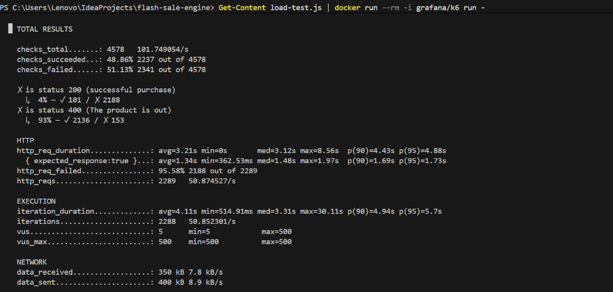

<h1 align="center">Highload Flash-Sale Engine</h1>

<p align="center">
  Высокопроизводительное ядро для e-commerce, спроектированное для обработки экстремальных всплесков трафика без риска овербукинга.
</p>

## Обзор проекта и его цели

Главная цель данного проекта - создание надежной backend-архитектуры, способной выдерживать массовые и внезапные скачки пользовательского трафика. Такие сценарии типичны для рекламных акций, "Черной пятницы" или ограниченных по времени флеш-распродаж.

В традиционных e-commerce архитектурах внезапные одновременные запросы на покупку ограниченного инвентаря часто приводят к взаимным блокировкам базы данных (deadlocks), сильной деградации производительности или "овербукингу" (продаже большего количества товаров, чем есть на складе). Данный проект решает эти проблемы путем переноса критических транзакционных узлов из реляционной базы данных в in-memory структуры, гарантируя при этом согласованность данных (eventual consistency) между микросервисами.

Проект спроектирован для демонстрации продвинутых практик backend-разработки уровня Senior, с фокусом на высокую доступность, отказоустойчивость, управление распределенными транзакциями и глубокий мониторинг.

## Технологический стек

- **Java 21** и **Spring Boot 4.x**: Основной фреймворк приложения (REST API, AOP, Actuator).
- **Redis и Lua**: In-memory хранилище для атомарных операций со складом и кэширования поиска.
- **Apache Kafka**: Брокер сообщений для событийно-ориентированной архитектуры и паттерна Saga.
- **PostgreSQL**: Реляционная база данных, использующая паттерн Transactional Outbox.
- **Elasticsearch**: Поисковый движок для молниеносных полнотекстовых запросов по каталогу товаров.
- **Spring Security и JWT**: Система масштабируемой аутентификации без сохранения состояния (stateless).
- **Resilience4j**: Реализация Rate Limiting и защиты от DDoS-атак.
- **Prometheus и Grafana**: Time-series база данных и визуализация для мониторинга JVM.
- **Grafana k6 и Docker**: Инструменты для нагрузочного тестирования и контейнеризации инфраструктуры.

---

## Архитектура и паттерны проектирования

### 1. Защита от овербукинга (Redis + Lua)
Традиционные транзакции РУБД (RDBMS) не справляются с экстремальной конкурентной нагрузкой из-за блокировок на уровне строк. В этом проекте проверка запасов полностью вынесена за пределы базы данных. Вместо этого используется атомарный Lua-скрипт, выполняемый непосредственно внутри Redis, для уменьшения остатков. Это позволяет обрабатывать тысячи конкурентных запросов на покупку в секунду с абсолютной согласованностью данных и нулевой вероятностью отрицательного остатка.

### 2. Распределенные транзакции (Паттерн Saga)
В экосистеме микросервисов локальных ACID-транзакций недостаточно. При оформлении заказа `PaymentSagaListener` асинхронно прослушивает события Kafka. Если платеж не проходит (в движке реализована динамическая симуляция отказов), система запускает компенсирующую транзакцию для отката статуса заказа до `FAILED` и возвращает товар на склад в Redis, обеспечивая согласованность в конечном счете (eventual consistency).

### 3. Надежная доставка событий (Transactional Outbox)
Для решения проблемы "двойной записи" (безопасное сохранение заказа в БД при одновременной публикации сообщения в Kafka без потери данных во время сбоев), в системе реализован паттерн Outbox. События сохраняются в таблицу `outbox_events` в рамках той же локальной ACID-транзакции, что и создание заказа. Затем фоновый планировщик безопасно публикует их в Kafka, гарантируя доставку *at-least-once*.

### 4. Защита от DDoS (Rate Limiting)
Для защиты базы данных и нижележащих сервисов от ботнетов или агрессивного трафика на критических эндпоинтах настроен Resilience4j. Он строго ограничивает количество запросов (например, 5 запросов в секунду на узел) и корректно отклоняет избыточный трафик со статусом HTTP `429 Too Many Requests`, гарантируя, что приложение останется отзывчивым для легитимных пользователей.

### 5. Высокоскоростное кэширование поиска
Elasticsearch обеспечивает быстрый полнотекстовый поиск, но сетевой ввод-вывод остается узким местом при высокой нагрузке. Абстракция `@Cacheable` используется для кэширования результатов запросов Elasticsearch напрямую в Redis, сокращая время отклика с 30 мс до менее чем 2 мс для популярных запросов.

---

## Мониторинг и нагрузочное тестирование

Система полностью инструментирована с помощью Micrometer. Prometheus активно собирает метрики JVM, состояния пула соединений HikariCP и HTTP-пропускной способности, визуализируя их в Grafana.

### Методология нагрузочного тестирования (K6)
Было проведено жесткое нагрузочное тестирование с использованием `k6`, имитирующее 500 одновременных виртуальных пользователей (VUs), атакующих API оформления заказа одновременно.

**Анализ результатов нагрузочного тестирования:**
- **Защита от DDoS:** Подавляющее большинство избыточных запросов было успешно перехвачено и ограничено, вернув `HTTP 429`. Это предотвратило исчерпание ресурсов CPU.
- **Абсолютная точность:** Были куплены ровно те товары, которые оставались в наличии, вернув `HTTP 200`. Как только запасы достигли нуля, последующие валидные запросы корректно получали `HTTP 400 (Out of stock)`.
- **Производительность системы:** Пул соединений HikariCP оставался стабильным, а Garbage Collector эффективно очищал молодое поколение (Eden space) без заметных пауз "Stop-The-World".

### Вывод терминала из стресс-теста K6
Ниже приведен вывод терминала, демонстрирующий успешное ограничение скорости и точную обработку 500 одновременных пользователей:



### Дашборды Grafana под нагрузкой

**Всплеск использования CPU во время теста K6 (500 VUs)**


**Циклы GC JVM Heap (G1 Eden Space)**


---

## Запуск проекта

1. **Запуск инфраструктуры (Docker Compose)**
   ```bash
   docker-compose up -d
   ```
   *Запускает PostgreSQL, Redis, Kafka, Elasticsearch, Prometheus и Grafana.*

2. **Запуск приложения**
   ```bash
   ./gradlew bootRun
   ```

3. **Доступ к сервисам**
   - Swagger UI: `http://localhost:8080/swagger-ui/index.html`
   - Grafana: `http://localhost:3000` (admin/admin)
   - Kafka UI: `http://localhost:8090`

4. **Запуск нагрузочного теста (K6)**
   ```bash
   Get-Content load-test.js | docker run --rm -i grafana/k6 run -
   ```
